# Obsidian Development Timeline

**A visual, evidence-linked history of the renderer from bootstrap to the current Phase 4 canary.**

[README](README.md) ·
[Timeline](TIMELINE.md) ·
[Roadmap](ai/MASTER_ROADMAP.md) ·
[Current state](ai/CURRENT_STATE.md) ·
[Contributing](CONTRIBUTING.md)

> [!NOTE]
> This page is a public visual summary. For exact active truth, package authority, promotion gates, and handoff instructions, `ai/CURRENT_STATE.md` is authoritative. For planned scope and phase ordering, use `ai/MASTER_ROADMAP.md`.

## Project arc

```mermaid
flowchart LR
    P0["Phase 0<br/>Bootstrap + compatibility<br/><b>COMPLETE</b>"]
    P1["Phase 1<br/>Vulkan/GPU foundations<br/><b>COMPLETE</b>"]
    P2["Phase 2<br/>Real-section correctness<br/><b>COMPLETE</b>"]
    P3["Phase 3<br/>Async CPU meshing + production terrain<br/><b>COMPLETE</b>"]
    P4["Phase 4<br/>GPU visibility at real-world scale<br/><b>ACTIVE</b>"]
    P5["Phase 5<br/>Frame pacing + adaptive streaming<br/><b>PLANNED</b>"]
    P6["Phase 6-12<br/>Transparency, entities, UI,<br/>experiments + stabilization<br/><b>PLANNED</b>"]

    P0 --> P1 --> P2 --> P3 --> P4 --> P5 --> P6

    classDef complete fill:#173f2b,stroke:#42b883,color:#ffffff,stroke-width:2px;
    classDef active fill:#473a17,stroke:#f2c94c,color:#ffffff,stroke-width:3px;
    classDef planned fill:#24292f,stroke:#8c959f,color:#ffffff,stroke-width:1px;

    class P0,P1,P2,P3 complete;
    class P4 active;
    class P5,P6 planned;
```

### Status at a glance

| Phase | Focus | Current state |
| --- | --- | --- |
| **0** | Minecraft/Fabric bootstrap, Vulkan-only boundary, CI/release/continuity foundations | ✅ Complete |
| **1** | GPU memory, synchronization, indirect drawing, compute visibility foundations | ✅ Complete |
| **2** | Real Minecraft section semantics, materials, light/AO, lifecycle and correctness oracle | ✅ Complete |
| **3** | Async CPU meshing, greedy geometry, differential correctness, production opaque/cutout replacement | ✅ Complete |
| **4** | Persistent large-scene GPU visibility and scalable draw generation | 🟡 **Active — P4.1 shadow canary** |
| **5** | Frame pacing, streaming and adaptive scheduling | ⏳ Planned |
| **6–12** | Transparency/fluids, entities, block entities, particles/weather, UI/text, optional advanced renderer features, stabilization | ⏳ Planned |

## Detailed visual timeline

```mermaid
flowchart TD
    A["2026-08-20<br/><b>Canonical roadmap v1</b><br/>Governance and long-range phase model established"]
    B["2026-08-22<br/><b>Phase 2 + P3.1 synchronized COMPLETE</b><br/>Real-section correctness + worker/scheduler base"]
    C["2026-08-22<br/><b>P3.2 + P3.3 complete</b><br/>Bitmask visibility + greedy rectangle extraction"]
    D["2026-08-23<br/><b>P3.4 dev6-dev9</b><br/>Render keys, candidate classification, repeat-aware UV proof"]
    E["2026-08-28<br/><b>dev10 complete</b><br/>Transport/sampling proof; dev11 geometry canary activated"]
    F["2026-08-29<br/><b>P3.4 + P3.5 + P3.6 complete</b><br/>Greedy emission visual PASS, border/halo proof, T-junction policy"]
    G["2026-08-29<br/><b>P3.7 + P3.8 complete</b><br/>Differential correctness + trustworthy benchmark baseline"]
    H["Early Sep 2026<br/><b>P3.9 rejected/deferred</b><br/>Partial remeshing misses frozen benefit threshold"]
    I["2026-09-02<br/><b>P3.10 promoted</b><br/>Production opaque/cutout terrain replacement merged"]
    J["2026-09-28<br/><b>Phase 4 P4.1 active</b><br/>Persistent large-scene shadow GPU visibility dev1 Preview"]
    K["2026-09-28<br/><b>Repository/public surface overhaul</b><br/>Preview channel, branch hygiene, maintained README"]
    L["2026-09-28<br/><b>Context Governor active + proven</b><br/>Recoverable LLM context + least-data API/OAuth calls"]
    M["NOW<br/><b>P4.1 reference runtime gate</b><br/>Shadow-only visibility must prove scale, exactness, lifetime + visual parity"]
    N["NEXT<br/><b>Measured Phase 4 slices</b><br/>Only after P4.1 runtime evidence closes"]
    O["FUTURE<br/><b>Phases 5-12</b><br/>Streaming, transparency, entities, UI, experiments, stabilization"]

    A --> B --> C --> D --> E --> F --> G --> H --> I --> J --> K --> L --> M --> N --> O

    classDef done fill:#173f2b,stroke:#42b883,color:#ffffff,stroke-width:2px;
    classDef rejected fill:#3d2020,stroke:#e5534b,color:#ffffff,stroke-width:2px;
    classDef active fill:#473a17,stroke:#f2c94c,color:#ffffff,stroke-width:3px;
    classDef future fill:#24292f,stroke:#8c959f,color:#ffffff,stroke-width:1px;

    class A,B,C,D,E,F,G,I,J,K,L done;
    class H rejected;
    class M active;
    class N,O future;
```

## Evidence-linked milestones

| Date | Milestone | What changed | Evidence |
| --- | --- | --- | --- |
| **2026-08-20** | Roadmap v1 | Canonical project mission, phase model and roadmap governance established. | [Master roadmap](ai/MASTER_ROADMAP.md) |
| **2026-08-22** | Phase 2 + P3.1 complete | Real-section correctness through P2.7 and the Phase 3 worker/scheduler foundation were synchronized as complete. | [Roadmap revision log](ai/MASTER_ROADMAP.md#16-roadmap-revision-log) |
| **2026-08-22** | P3.2 complete | Six-direction bitmask visibility path promoted. | [PR #36](https://github.com/TrissTheBoss/Obsidian/pull/36) · merge `54ca3cb2` |
| **2026-08-22** | P3.3 complete | Greedy rectangle extraction promoted while the reference drawable remained authoritative. | [PR #37](https://github.com/TrissTheBoss/Obsidian/pull/37) · merge `34caa19a` |
| **2026-08-23** | P3.4 dev6-dev9 | Canonical render keys, merge candidates, four-vertex safety and repeat-aware UV representability were proven incrementally. | [PR #38](https://github.com/TrissTheBoss/Obsidian/pull/38) · [#39](https://github.com/TrissTheBoss/Obsidian/pull/39) · [#40](https://github.com/TrissTheBoss/Obsidian/pull/40) · [#41](https://github.com/TrissTheBoss/Obsidian/pull/41) |
| **2026-08-28** | dev10 complete | Repeat-aware transport/sampling proof closed; dev11 geometry-changing canary activated with mandatory visual validation. | [PR #42](https://github.com/TrissTheBoss/Obsidian/pull/42) |
| **2026-08-29** | P3.4 complete | Repeat-aware greedy GPU emission canary passed exact accounting, clean lifetime and explicit human visual validation. | [PR #44](https://github.com/TrissTheBoss/Obsidian/pull/44) · merge `b01ff98c` |
| **2026-08-29** | P3.5 complete | Border/halo correctness closed with exact reference/shared-border agreement and clean runtime/lifetime evidence. | [PR #46](https://github.com/TrissTheBoss/Obsidian/pull/46) · merge `1f34b3e4` |
| **2026-08-29** | P3.6 complete | Real strict T-junction topology was proven and visually accepted on the reference Vulkan path without global mitigation. | A-0149 in [attempt history](ai/attempts/) |
| **2026-08-29** | P3.8 complete | First trustworthy full-section meshing benchmark baseline promoted; P3.9 experimental partial remeshing activated. | [PR #52](https://github.com/TrissTheBoss/Obsidian/pull/52) · merge `49385aed` |
| **Early Sep 2026** | P3.9 rejected/deferred | Fixed four-Y-slice partial remeshing failed the frozen projected-upload benefit threshold and was not promoted. | A-0188 · [Current state](ai/CURRENT_STATE.md) |
| **2026-09-02** | **Phase 3 complete / P3.10 promoted** | Validated production opaque/cutout terrain replacement merged to `main`; Phase 4 activated. | [PR #56](https://github.com/TrissTheBoss/Obsidian/pull/56) · merge `01547b55` |
| **2026-09-28** | P4.1 dev1 Preview | Persistent large-scene GPU visibility packaged as a **shadow-only** canary; production draw ownership remains on P3.10. | [PR #57](https://github.com/TrissTheBoss/Obsidian/pull/57) · [Current state](ai/CURRENT_STATE.md) |
| **2026-09-28** | Repository/public surface cleanup | `main` became the only permanent branch, Preview prereleases became the tester channel, and the public README/release flow was formalized. | A-0207 · [Repository hygiene](ai/REPOSITORY_HYGIENE.md) |
| **2026-09-28** | Context Governor activated | Tiered recoverable context, automatic fail-closed compression, call-specific API/MCP minimization, and least-privilege OAuth policy were integrated and CI-proven. | [PR #61](https://github.com/TrissTheBoss/Obsidian/pull/61) · A-0208/A-0209 |
| **2026-09-28** | Context Governor continuity closed | Final activation evidence, current-state synchronization and active-capsule refresh merged to `main`. | [PR #62](https://github.com/TrissTheBoss/Obsidian/pull/62) · merge `dcfe73eb` |

## Where the project is now

### Phase 4 / P4.1 — active

The current test build is **`0.4.0-phase4-dev1`**. P4.1 is deliberately **shadow-only**: it builds and validates the persistent large-scene GPU visibility system beside the proven P3.10 production terrain renderer.

Before P4.1 can be promoted, the reference-machine run must prove, among other frozen gates:

- real large-scene scale;
- zero missing, unexpected or duplicate visibility identities;
- `gpuFalseCullCount=0`;
- no scene-capacity failure;
- nonblocking readback/lifetime behavior;
- no camera-only full-scene Java scan;
- no production draw-ownership change;
- no native graphics-ownership expansion;
- inherited P3.10/P3.7/worker/lifetime gates remain clean;
- normal process exit;
- explicit human visual parity with the P3.10 baseline.

See [Current state](ai/CURRENT_STATE.md) and the frozen P4.1 contract in [A-0203](ai/attempts/A-0203-phase4-p4.1-persistent-scene-gpu-visibility-contract.md).

## Future phase horizon

Future phases remain evidence-driven rather than date-driven. A planned phase is not considered implemented merely because it appears here; promotion requires the validation evidence defined by the roadmap and the active contract for that milestone.

## Navigation

- **Start here:** [README](README.md)
- **Exact current truth:** [ai/CURRENT_STATE.md](ai/CURRENT_STATE.md)
- **Long-range plan:** [ai/MASTER_ROADMAP.md](ai/MASTER_ROADMAP.md)
- **Engineering process:** [ai/OPERATING_MANUAL.md](ai/OPERATING_MANUAL.md)
- **Architecture/product decisions:** [ai/DECISIONS.md](ai/DECISIONS.md)
- **Immutable engineering evidence:** [ai/attempts/](ai/attempts/)
- **Contributing:** [CONTRIBUTING.md](CONTRIBUTING.md)
